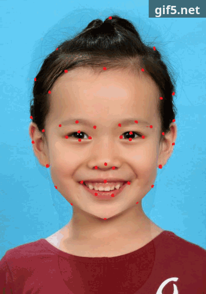

<h1 style="text-align: center;">《计算机视觉与模式识别》第五次作业——人脸渐变</h1>

<h4 style="text-align: right;">14331015 陈海城</h4>

### 文件结构说明
```
.
├── input
├── make
├── output
├── source
└── target
```
`input`文件夹下存在放的是输入文件，包括`1.bmp/1.txt/2.bmp/2.txt`，其中`1.bmp`和`2.bmp`分别为起始图片和终止图片，`1.txt`和`2.txt`为这两幅输入图像手工标注的特征点文件；<br />
`make`文件夹下存放的是`makefile`文件；<br />
`output`文件夹下保存的是运行结果图；<br />
`source`文件夹下保存的是源代码问价；<br />
`target`文件夹下保存的是可执行文件`Run`

### 环境说明
1. 运行环境: `Linux` + `opencv`
2. 编译源码: 在`make`文件夹下，执行`make`指令，然后在该文件夹下会生成可执行文件`Run`。输入`./Run`即可执行

### 实验说明
1. 实验目的：image morphing，即实现人脸渐变，中间生成11帧过渡图
2. 实验中用到的算法：delaunay——三角剖分算法、 Image Morphing、 重心法
3. 算法用途说明：
	* delaunay: 将每三个点画成一个三角形，这些三角形互不相交。这里我使用的是`opencv`自带的`getTriangleList()`函数，没有自己实现
	* Image Morphing: 人脸渐变，其处理过程在下面
	* 重心法：用于判断点是否在三角形内，其具体实现为`Morphing.h`中的`isInTriangle()`函数

### 人脸变形处理过程
1. 网格生成<br />
将源图像和目标图像通过建立特征点，形成点集，然后通过三角剖分的方法形成三角形网络。
其中涉及到的问题有：
	1. 怎样把源图像中形成的三角形和目标图像生成的三角形（三角形对）对应起来。（对整体的源图像和目标图像来说，他们划分出网格之后，应该是同构的。）
	2. 通过源三角形和目标三角形的顶点坐标值，使用仿射变换求出变换从源三角形到目标三角形的变换矩阵T。
2. 中间帧生成<br />
对其中一个三角形对来说,中间帧的生成过程是这样的：
	1. 通过变换矩阵T，求得三角形对的对应像素点坐标。
	2. 定位源三角形内部像素点P0的RGB值，经过线型插值运算：Pinternal=(1-1/n)P0+(1/n)P1（Pinternal是中间帧像素点RGB值，P1是目标像素点RGB值，n为变形动画的帧数）获得中间帧中点Pinternal的RGB值。

### 问题记录
1. 在判断目标点位于哪个三角形时，我采用的是**重心法**。即对每个像素点，都遍历所有的三角形，运用**重心法**找到目标三角形。代码如下：
```c++
/* 重心法 判断点是否在三角形内 */
bool Morphing::isInTriangle(vector<int> &ABC, vector<Point> &points, int &row, int &col) {
	int v0_x = points[ABC[1]].x - points[ABC[0]].x,
		v0_y = points[ABC[1]].y - points[ABC[0]].y,
		
		v1_x = points[ABC[2]].x - points[ABC[0]].x,
		v1_y = points[ABC[2]].y - points[ABC[0]].y,
		
		v2_x = col - points[ABC[0]].x,
		v2_y = row - points[ABC[0]].y;

	int s12 = v1_x * v2_x + v1_y * v2_y,
		s00 = v0_x * v0_x + v0_y * v0_y,
		s02 = v0_x * v2_x + v0_y * v2_y,
		s01 = v0_x * v1_x + v0_y * v1_y,
		s11 = v1_x * v1_x + v1_y * v1_y;

	double inverDeno = 1 / double(s11 * s00 - s01 * s01);

	double x = (s02 * s11 - s12 * s01) * inverDeno,
	       y = (s12 * s00 - s02 * s01) * inverDeno;

	if (x < 0 || y < 0 || x > 1 || y > 1) return false;
	return x + y <= 1;
}
```
2. 在计算中间帧时，我采用的做法如下：<br />
对于中间图的一个三角形$a$,起始图对应的三角形 $b$，终止图对应的三角形$c$
	1. 计算从$a$到$b$变换矩阵$M$，然后计算从$a$到$c$ 的变换矩阵$N$
	2. 对应中间图的目标点$x$，计算$M*x$和$N* x$，即计算投影在起始图和目标图的点$m$和$n$
	3. 运用公式：$Pixel(x)=(1-factor)*Pixel(m)+factor*Pixel(m)$<br />代码如下：
```c++
	cimg_forXY(this->disImg, x, y) {
		X(0, 0) = x; X(0, 1) = y; X(0, 2) = 1;
		if ((int)where(x, y) != -1) {
			U_0 = matrixs[0][(int)where(x, y)] * X;
			U_1 = matrixs[1][(int)where(x, y)] * X;
			U_0(0, 0) /= U_0(0, 2); U_0(0, 1) /= U_0(0, 2);
			U_1(0, 0) /= U_1(0, 2); U_1(0, 1) /= U_1(0, 2);
		} else {
			U_0(0, 0) = x; U_0(0, 1) = y;
			U_1(0, 0) = x; U_1(0, 1) = y;
		}
		// 保证点在图像内
		U_0(0, 0) = U_0(0, 0) < 0 ? 0 : U_0(0, 0); U_0(0, 1) = U_0(0, 1) < 0 ? 0 : U_0(0, 1);
		U_1(0, 0) = U_1(0, 0) < 0 ? 0 : U_1(0, 0); U_1(0, 1) = U_1(0, 1) < 0 ? 0 : U_1(0, 1);
		// 计算像素值
		this->midImg(x, y, 0) = this->srcImg(U_0(0, 0), U_0(0, 1), 0) * (1 - factor) + \
						  this->disImg(U_1(0, 0), U_1(0, 1), 0) * factor;
		this->midImg(x, y, 1) = this->srcImg(U_0(0, 0), U_0(0, 1), 1) * (1 - factor) + \
						  this->disImg(U_1(0, 0), U_1(0, 1), 1) * factor;
		this->midImg(x, y, 2) = this->srcImg(U_0(0, 0), U_0(0, 1), 2) * (1 - factor) + \
						  this->disImg(U_1(0, 0), U_1(0, 1), 2) * factor;
	}
```
3. 实验标定特征点十分重要，特征点选取的好坏，对后面实验成功的效果十分关键

### 实验结果展示
<center>
	<figure style="display: inline-block">
		
		<figcaption>动态图</figcaption>
	</figure>
</center>
<center>
	<figure style="display: inline-block">
		
		<figcaption>0</figcaption>
	</figure>
	<figure style="display: inline-block">
		
		<figcaption>1</figcaption>
	</figure>
	<figure style="display: inline-block">
		
		<figcaption>2</figcaption>
	</figure>
	<figure style="display: inline-block">
		
		<figcaption>3</figcaption>
	</figure>
	<figure style="display: inline-block">
		
		<figcaption>4</figcaption>
	</figure>
	<figure style="display: inline-block">
		
		<figcaption>5</figcaption>
	</figure>
	<figure style="display: inline-block">
		
		<figcaption>6</figcaption>
	</figure>
	<figure style="display: inline-block">
		
		<figcaption>7</figcaption>
	</figure>
	<figure style="display: inline-block">
		
		<figcaption>8</figcaption>
	</figure>
	<figure style="display: inline-block">
		
		<figcaption>9</figcaption>
	</figure>
	<figure style="display: inline-block">
		
		<figcaption>10</figcaption>
	</figure>
	<figure style="display: inline-block">
		
		<figcaption>11</figcaption>
	</figure>
</center>